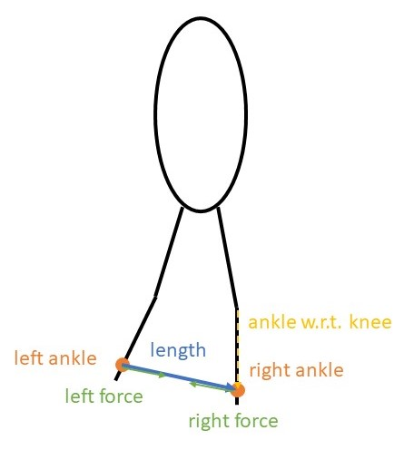

# Modelling assistive devices

**Note: currently, these examples use the PredSim version at https://github.com/KULeuvenNeuromechanics/PredSim_private/tree/dev-orthosis.**

In PredSim, assistive devices can be modelled by using the Orthosis interface and modifying the OpenSim model. The examples below illustrate different possibilities.

## Example 1. Changing the parameters of an existing orthosis

The script [example_1](./example_1.m) shows how to set up a predictive simulation with a bilateral ankle exoskeleton. The exoskeleton provides an ankle plantarflexion torque proportional to the ipsilateral soleus activation. 
This exoskeleton is already implemented (PredSim/WearableDevices/ankleExoEmgProportional.m). The controller gain has to be set when adding the exoskeleton to a simulation.

Run simulations with different gain values to explore the effect on the gait pattern.

Use PredSim/PlotFigures/run_this_file_to_plot_figures.m to plot the variables of interest for the different results.

## Example 2. Defining a custom orthosis

The Orthosis interface aims to provide an intuitive way to define custom orthoses (or other wearable devices).
To access the documentation of the Orthosis interface, run `help Orthosis` in the matlab command window (make sure PredSim/WearableDevices is on the matlab search path).

### 2.1. A passive elastic hip exoskeleton (easy)

Complete the function [hipExoPassiveElastic](./hipExoPassiveElastic.m) (see PredSim/WearableDevices/parametricAFO.m for inspiration) and run [example_2](./example_2.m).

### 2.2. A rubber band connecting both ankles (hard)

Complete the function [rubberBandBetweenAnkles](./rubberBandBetweenAnkles.m) and run [example_2](./example_2.m) (Make sure you select the correct orthosis).

Fig 1. Sketch of relevant vectors for calculation.

Assume the rubber band is a linear spring. The force is then given by: $F = K*(l-l_0) \quad if \ l-l_0 > 0$

In the 2D example model, the distance between the ankles ($l$) is always greater than 16 cm. If $l_0$ is below this value, you can ignore the tension-only constraint on the force.
To include the tension-only constraint, the function PredSim/VariousFunctions/smoothIf to approximate an if-statement such that it is compatible with algorithmic differentiation.

Have the results file include the length and force of the rubber band (see `help Orthosis/addVarToPostProcessing`), so their values can be [plotted](./plot_result_example_2_2.m).

## Example 3. Modelling orthosis inertia

Example 1 and 2 assume the orthoses are massless. To model the mass and inertia, they need to be included in the OpenSim model.

1. Create a copy of PredSim/Subjects/gait1018/gait1018.osim, e.g. gait1018_exoMass1.osim, in the same folder.
2. In the new model, create a new Body (mass, inertia) for each part of the orthosis, and connect it to another body with a WeldJoint (= rigid connection).
Possible ways to adapt an OpenSim model include:
    - [OpenSim Creator](https://www.opensimcreator.com/): convenient and intuitive
    - open the model as a text file (e.g. notepad++, Visual Studio Code, matlab): oldschool
    - write matlab code that uses the OpenSim api to adapt the model: if you are feeling adventurous
3. Run [example_3](./example_3.m)

*Important:* if you want to change any of the model parameters, create a new model with a different name.

## Example 4. Walking with crutches
