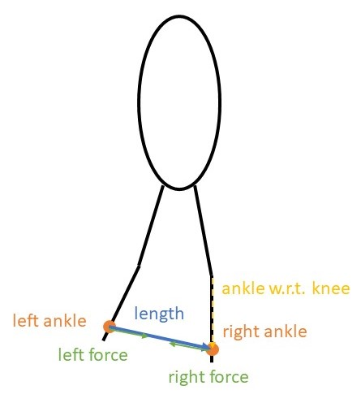

# Modelling assistive devices

In PredSim, assistive devices can be modelled by using the Orthosis interface and modifying the OpenSim model. The examples below illustrate different possibilities.

## Example 1. Changing the parameters of an existing orthosis

The script [example_1](./example_1.m) shows how to set up a predictive simulation with a bilateral ankle exoskeleton. The exoskeleton provides an ankle plantarflexion torque proportional to the ipsilateral soleus activation. 
This exoskeleton is already implemented (PredSim/WearableDevices/ankleExoEmgProportional.m). The controller gain has to be set when adding the exoskeleton to a simulation.

Run simulations with different gain values to explore the effect on the gait pattern.

Use [plot_result_example_1](./plot_result_example_1.m) to plot the variables of interest.

## Example 2. Defining a custom orthosis

The Orthosis interface aims to provide an intuitive way to define custom orthoses (or other wearable devices).
To access the documentation of the Orthosis interface, run `help Orthosis` in the matlab command window (make sure PredSim/WearableDevices is on the matlab search path).

### 2.1. A passive elastic hip exoskeleton (easy)

Complete the function [hipExoPassiveElastic](./hipExoPassiveElastic.m) (see PredSim/WearableDevices/parametricAFO.m for inspiration) and run [example_2](./example_2.m).

Adapt [plot_result_example_1](./plot_result_example_1.m) to plot the variables of interest.

### 2.2. A rubber band connecting both ankles (hard)

[Simpson et al found that connecting the legs with a spring improves running economy](https://doi.org/10.1242/jeb.202895). Let's try to simulate their experiments.

Complete the function [rubberBandBetweenAnkles](./rubberBandBetweenAnkles.m) and run [example_2](./example_2.m) (Make sure you select the correct orthosis).

Fig 1. Sketch of relevant vectors for calculation.

The rubber band wraps around the ankles at 40 cm below the knee joint centre. i.e. position `[0,-0.4,0]` in `tibia_r` and `tibia_r`.

Assume the rubber band is a linear spring. The force is then given by: $F = K*(l-l_0) \quad if \ l-l_0 > 0$

In the 2D example model, the distance between the ankles ($l$) is always greater than 16 cm. If $l_0$ is below this value, you can ignore the tension-only constraint on the force.
To include the tension-only constraint, the function PredSim/VariousFunctions/smoothIf to approximate an if-statement such that it is compatible with algorithmic differentiation.

Have the results file include the length and force of the rubber band (see `help Orthosis/addVarToPostProcessing`), so their values can be [plotted](./plot_result_example_2_2.m).

## Example 3. Modelling orthosis inertia

Example 1 and 2 assume the orthoses are massless. To model the mass and inertia, they need to be included in the OpenSim model.

Consider an ankle exoskeleton that consists of two parts: shank and foot.
shank is rigidly connected to the tibia and has
- mass = 0.44 kg
- mass centre = [0, -0.2, 0] m
- inertia = [0.0073 0.0027 0.0066 0 0 0] kgm²

foot is rigidly connected to the calcn and has
- mass = 0.44 kg
- COM = [0.044, 0.030, 0] m
- inertia = [0.0021 0.0068 0.0050 0 0 0] kgm²

Add this exoskeleton to the model (bilaterally)

1. Create a copy of PredSim/Subjects/gait1018/gait1018.osim, e.g. gait1018_exoMass1.osim, in the same folder.
2. In the new model, create a new Body (mass, inertia) for each part of the orthosis, and connect it to another body with a WeldJoint (= rigid connection).
Possible ways to adapt an OpenSim model include:
    - [OpenSim Creator](https://www.opensimcreator.com/): convenient and intuitive
    - open the model as a text file (e.g. notepad++, Visual Studio Code, matlab): oldschool
    - write matlab code that uses the OpenSim api to adapt the model: if you are feeling adventurous
3. Run [example_3](./example_3.m)

#### OpenSim Creator
1. Add body
    - Add > Body > pop-up > + add body
2. Visualisation (optional)
    - Navigator: bodyset: exoFoot_r (right-click) > Add Offset Frame
    - Navigator: bodyset: exoFoot_r: exoFoot_r_offsetframe (right-click) > Add Geometry
    - Use properties of offsetframe and geometry to change  position, orientation and size

*Important:* if you want to change any of the OpenSim model parameters, create a new model with a different name.

