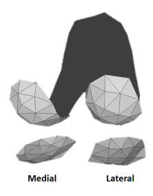

# Workshop 3: Integration of mesh-based contact models

This is the content of workshop 3 based on the application of mesh-based contact models into optimal control problems. 

Here we model only the contact at a right **knee prosthesis**. The femoral component is assumed to be fixed. The tibial component has six degrees of freedom (knee flexion-extension, abduction-adduction, internal-external rotations, and anterior-posterior, superior-inferior and medial-lateral translations). 

The formulated optimal control problem is simple. We track knee experimental kinematics (6 dofs) of a gait trial (starting from left heel contact) and knee experimental medial and lateral resultant contact forces. The main code is in [main.m](main.m). The cost function has the following terms:
 $J=J_{track_{KCF}}+J_{track_q}+J_{min_{\ddot{q}}}+J_{min_{q_{kneesec}}}$
* $J_{track_{KCF}}$ is the error between experimental and model knee contact forces, its associated weight factor is W.trackKCF
* $J_{track_q}$ is the error between experimental and model knee kinematics, its associated weight factor is W.trackq
* $J_{min_{\ddot{q}}}$ represents the scaled accelerations. This is included for regularization purposes. Its associated weight factor is W.q_dotdot.
* $J_{min_{q_{kneesec}}}$ represents the deviation of the secondary knee degrees of freedom abduction-adduction and internal-external rotations, and anterior-posterior medial-lateral translations. Its associated weight factor is W.minsecq.

In this NLP, we only impose continuity and dynamic constraints to ensure that the coordinates and their derivatives are smooth.
As a result, R contains the model kinematics and knee contact forces (R.kinematics and R.ContactForces) that minimizes differences with experimental data.  

The code works on Windows, with the software MATLAB and [CasADi](https://web.casadi.org/get/).

The code resembles the strcuture of the current version of PredSim (Sept. 2024), although this is a tracking simulation. The data used in this seminar (geometry of the prosthesis in .stl files, experimental data of the knee flexion, and experimental knee contact forces) are from the Knee Grand Challenge to Predict In Vivo Knee Contact Loads:

*Benjamin J Fregly, Thor F Besier, David G Lloyd, Scott L Delp, Scott A Banks, Marcus G Pandy, Darryl D D'Lima. Grand challenge competition to predict in vivo knee loads. J Orthop Res. 2012 Apr;30(4):503-13.*

A publication of the full mesh-based contact model is under preparation, a preliminary model was published in:

*Serrancolí, G; Torner, J; Perelli, S; Monllau, J.C. On the use of mesh-based joint contact models within simulations using automatic differentiation. Computer Methods, Imaging and Visualization in Biomechanics and Biomedical Engineering II pp 244–249. 2022. [https://doi.org/10.1007/978-3-031-10015-4_21](https://doi.org/10.1007/978-3-031-10015-4_21).*

Authors: Gil Serrancolí and Mohanad Harba  
September 2024
