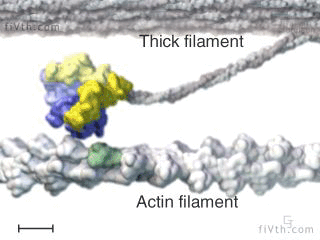
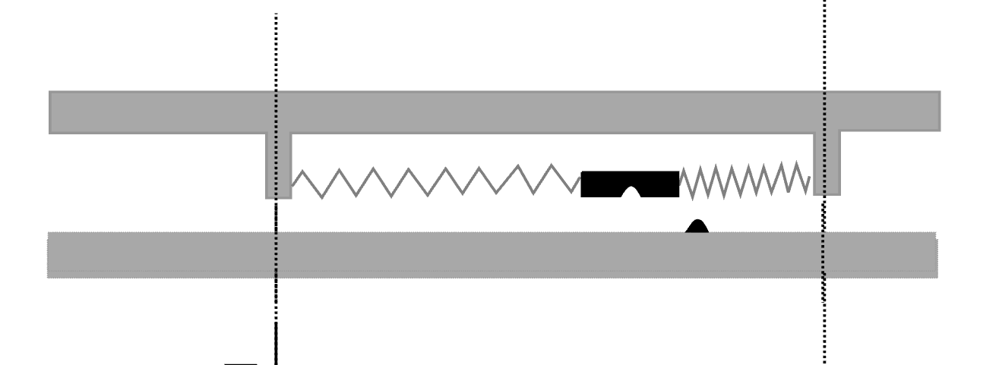
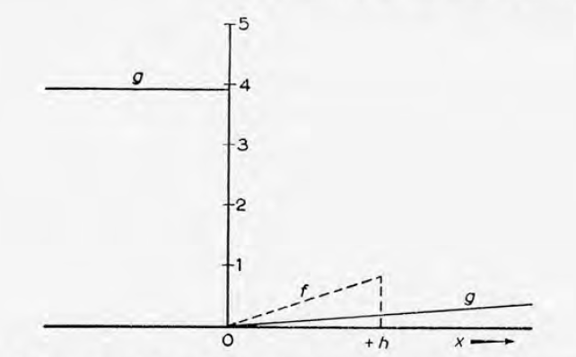
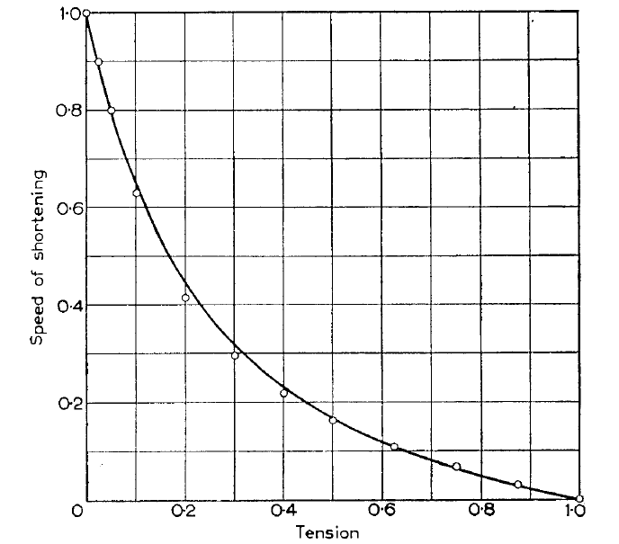

# S5 Mechanistic muscle models

This hands-on tutorial is an introduction into mechanistic muscle models. 
In the tutorial, you will compare the 2-state crossbridge model of [Huxley (1957)](https://pubmed.ncbi.nlm.nih.gov/13485191/) to existing phenomenological Hill-type muscle models (used in PredSim & OpenSim). While mechanistic crossbridge models have not yet been incoorporated into the PredSim framework (this is work in progress), this tutorial provides custom code to run forward simulations with these models. The mechanistic muscle modeling framework is based on [van der Zee et al., (2024)](https://doi.org/10.1242/jeb.247436), and the associated [CaFaXC muscle model](https://github.com/timvanderzee/CaFaXC). 

## Background
Crossbridges are the molecular motors underlying muscle contraction, force production and energy consumption. 
Force is produced when crossbridges attach and rotate, resulting in a pull on the actin filament.
Energy is required (from ATP) for crossbridge detachment.

Animation from [Vale & Milligan (2000)](https://doi.org/10.1126/science.288.5463.88)

Andrew Huxley (1957) formulated a simple mechanistic model of crossbridge cycling, in which crossbridges can be either attached or detached. The model tracks the proportion of attached crossbridge as a function of both crossbridge strain and time. 

Huxley formulated crossbridge attachment (f) and detachment (g) rate functions that depended on crossbridge strain x, parameterized by rate constants. The piece-wise linear formulation of the rate functions was simple, yet sufficient to predict A.V. Hill's force-velocity relation.

The graph below shows the agreement between Hill's force-velocity relation (line) and the force-velocity relation produced by Huxley's crossbridge model (circles)

 The three figures above are from [Huxley (1957)](https://pubmed.ncbi.nlm.nih.gov/13485191/).

 In this tutorial, you will learn how:
- Hill's force-velocity relation arises from Huxley's mechanistic crossbridge model
- Hill-type force-velocity parameters (e.g. vmax, curvature) relate to Huxley's crossbridge rate constants
- Approximating Huxley's crossbridge model affects the relation between rate constants and force-velocity
- Mechanistic crossbridge models can be interfaced with elastic tendon
- Force transients resulting from isokinetic joint rotations differ between Hill-type and crossbridge models

## Scripts
- **S5_main.m**: standalone script of this tutorial.

## Dependencies
This project requires the following:
- Microsoft Windows 10 or 11.
- MATLAB (R2021a or later recommended) 
- CaFaXC repository: https://github.com/timvanderzee/CaFaXC

## Contact
If you have any questions or inquiries, please feel free to contact Tim van der Zee at tim.vanderzee@kuleuven.be
