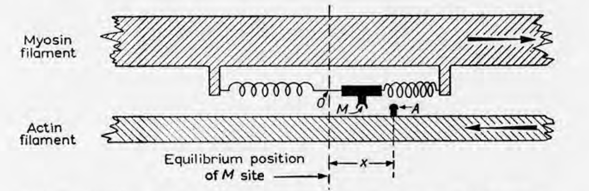

# S5 Mechanistic muscle models

In this hands-on tutorial, you will compare phenomenological Hill-type muscle models (used in PredSim & OpenSim) to mechanistic muscle models.
Specifically, 2-state crossbridge models of [Huxley (1957)](https://pubmed.ncbi.nlm.nih.gov/13485191/) are evalulated. 
While mechanistic crossbridge models have not yet been incoorporated into the PredSim framework (this is work in progress), this tutorial provides code to run forward simulations with these models. 
The models are based on a recent [publication](https://doi.org/10.1242/jeb.247436), with associated [BioRxiv pre-print](https://www.biorxiv.org/content/10.1101/2024.08.07.606988v1)
and [code repository](https://github.com/timvanderzee/CaFaXC). 

## Background
Crossbridges are the motors underlying muscle contraction and force production. Crossbridge go through attachment and detachment cycles.

Huxley (1957) formulated a simple model of crossbridge cycling, in which crossbridges can be either attached or detached.
The model tracks the proportion of attached crossbridge as a function of both crossbridge strain x and time. 

## Dependencies
This project relies on the following:
- Microsoft Windows 10 or 11.
- MATLAB (R2021a or later recommended) 
- CaFaXC repository: https://github.com/timvanderzee/CaFaXC

## Contact
If you have any questions or inquiries, please feel free to contact Tim van der Zee at tim.vanderzee@kuleuven.be
